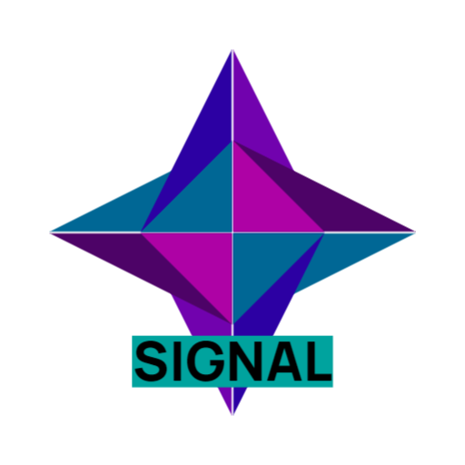

# Asgel Logic Signal Manipulation

    

This repository is related to [this project][main project], and is a bundle of logic gates to be used in logic simulations.  
This bundle aims to add signal manipulation gates, and a system of **model boxes**, allowing you to use other logic models as functional components in other models.
Be reminded that this uses the **relativity system**, which means that you need to place all the relevant files in your **working directory**

## Table of contents
* [Input and Output Nodes](#input-and-output-nodes)

## Input and Output Nodes

In order to make a model ready to be used as an independant component, you need to specify how signals enter and exit your model, through the use of **input nodes** and **output nodes**. Each one of these nodes must be defined with a unique id, **among all nodes**. As an example, suppose that you have a model where you want 2 entry points, with a data size of 8, and an exit point, with a data size of 4. In this case, you can define 2 input nodes, with id respectively equal to 0 and 1, and an output node whose id is 2.  
The orientation of the node is also important, it defines it's position on the resulted functional component. You can rotate components in your model with pressing R while highlighting it with your mouse.  

[main project]:https://github.com/AsgelTaren/AsgelLogicSimulator